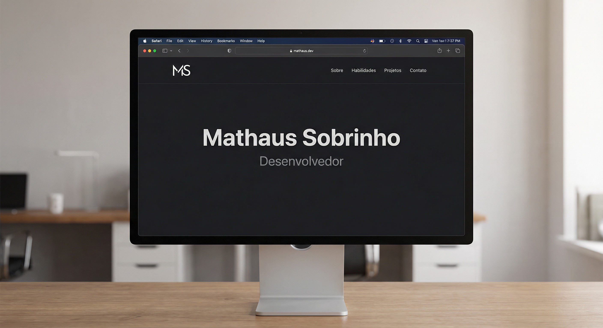

# Landing Page – Mathaus Sobrinho

Landing page de portfólio com seções: sobre, habilidades, projetos e contato.

## Preview



> **Dica:** Para atualizar a imagem acima, substitua o arquivo `assets/preview.png` por um screenshot do site (por exemplo, tirando um print da tela no navegador).

## Estrutura

- `index.html` – estrutura da página
- `styles.css` – estilos (tema escuro, responsivo)
- `script.js` – lista de projetos, menu mobile, animações
- `favicon.svg` – ícone do site
- `HD.png` – foto do perfil

## Como rodar localmente

Abra a pasta no navegador ou use um servidor local:

```bash
npx serve
# ou
python -m http.server 3000
```

Acesse em `http://localhost:3000` (ou na porta indicada).

## Licença

Uso pessoal / portfólio.
